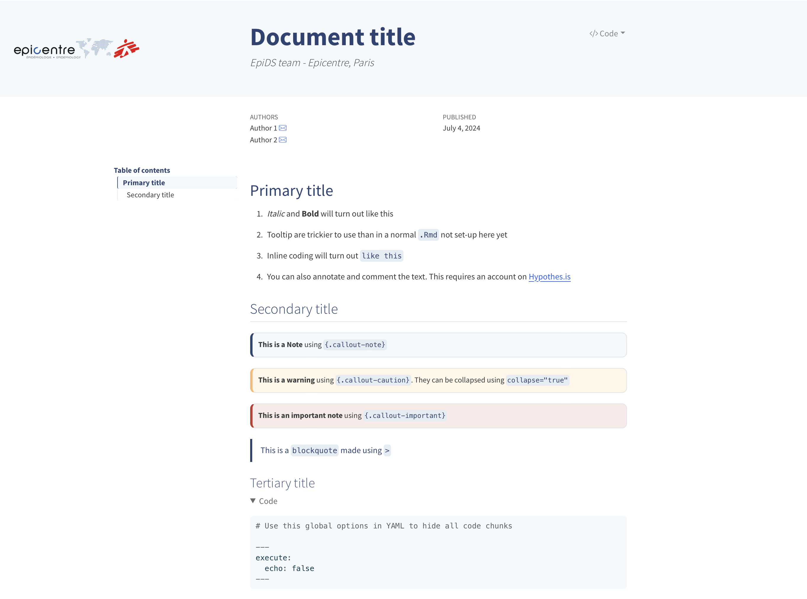
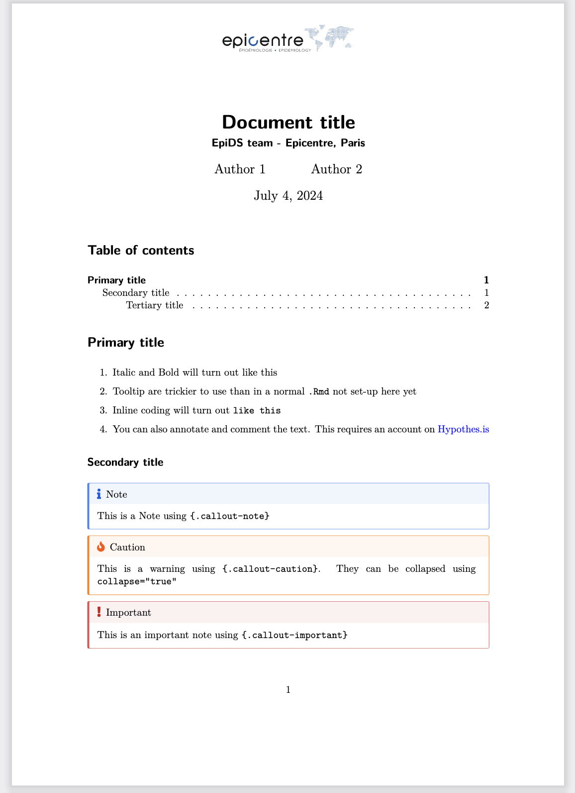
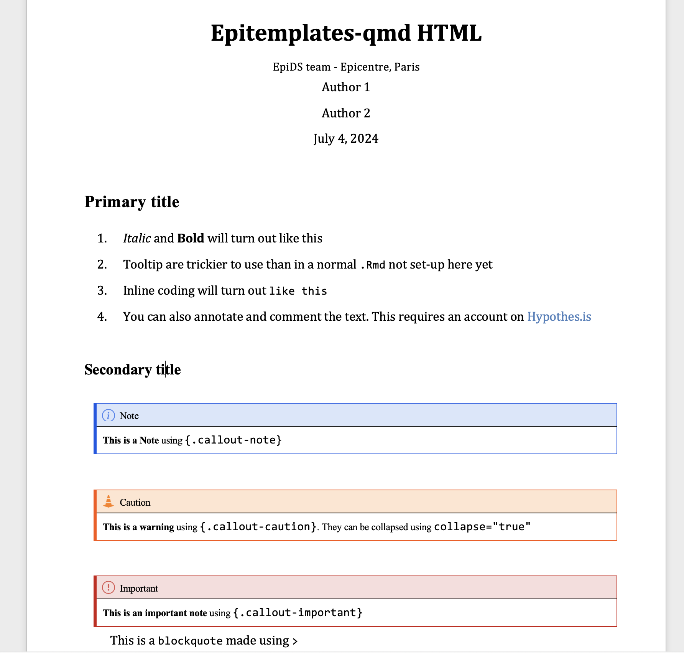
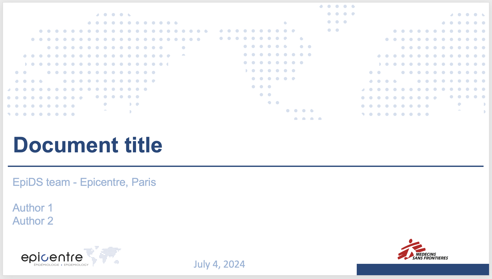
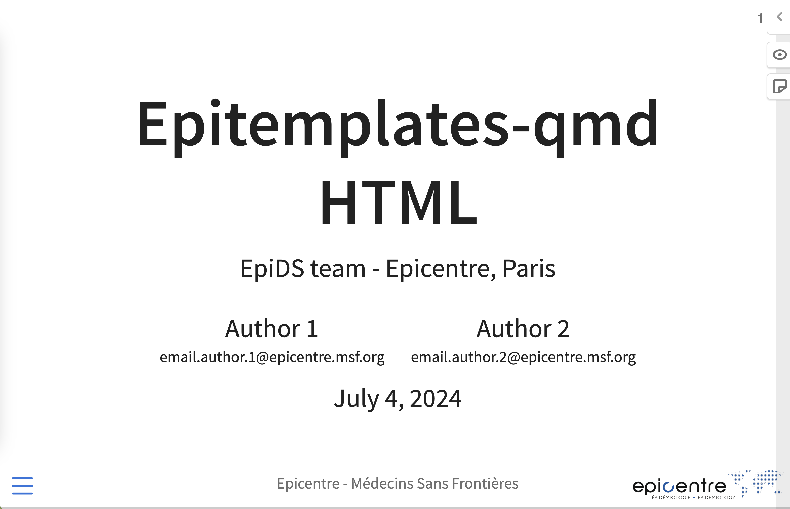

# epitemplates-report

EpiDS templates for quarto documents and presentations in mutiple formats

## Installation and usage

This project is distributed as a **Quarto template**, not a standalone extension.

It includes a complete project scaffold (e.g. `.img/`, template file, etc.),
which **cannot be installed via `quarto add`**.

To create a new report using this template:

```bash
quarto use template epicentre-msf/epitemplates-report
```

And add the format to your YAML configuration, along with other HTML format options if needed:

```yaml
format:
    epicentre-report-html:
        toc: true
        toc-depth: 3
        logo1: img/epicentre_msf_logo_transparent.png # top left of header
        logo2: img/another_logo.png # top right of header
```

Alternatively, you can also use the [epitemplates](https://github.com/epicentre-msf/epitemplates) R package from within R/Rstudio.
The template provides different formats, presented bellow.

## Formats

<div align="center">

**`epitemplates-report-html`: html document**



**`epitemplates-report-pdf`: pdf document**



**`epitemplates-report-docx`: word document**



**`epitemplates-report-pptx`: powerpoint presentation**



**`epitemplates-report-revealjs`: revealjs presentation**


</div>
