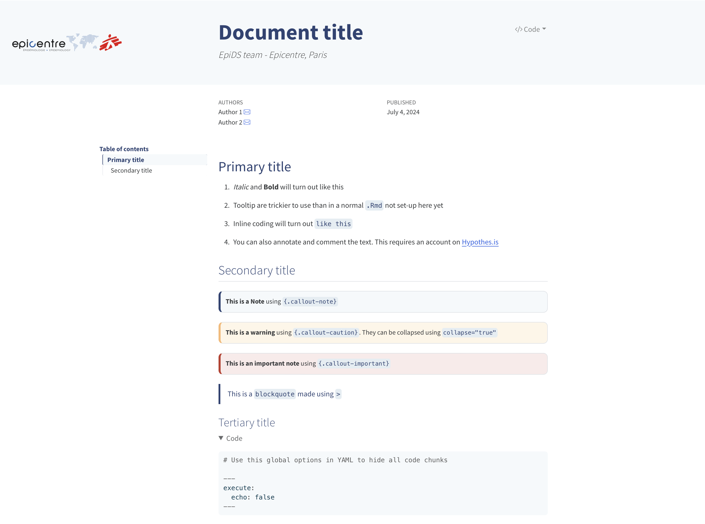
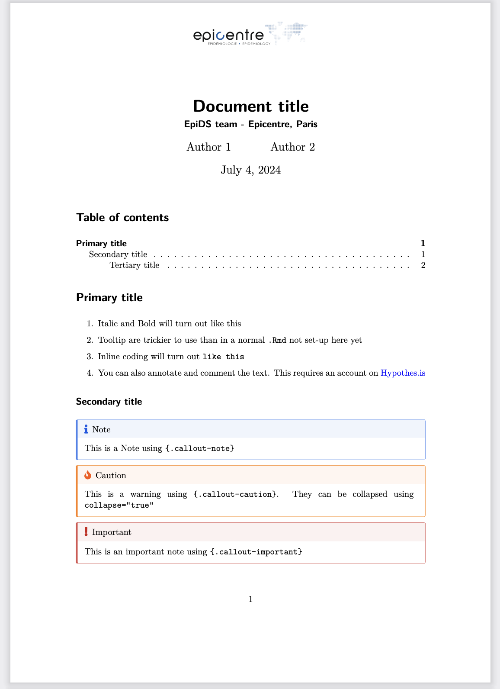
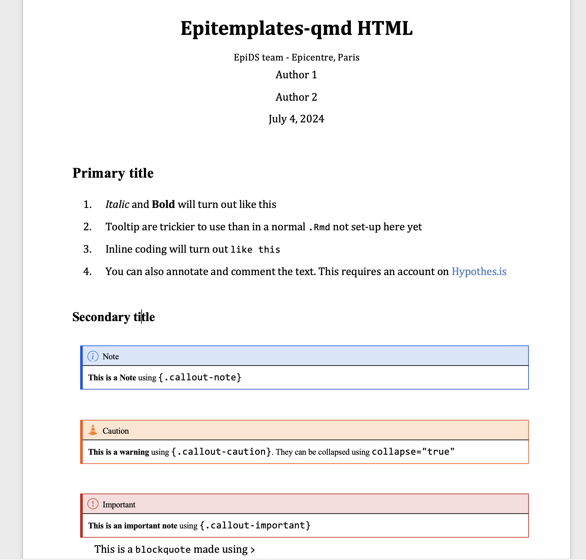
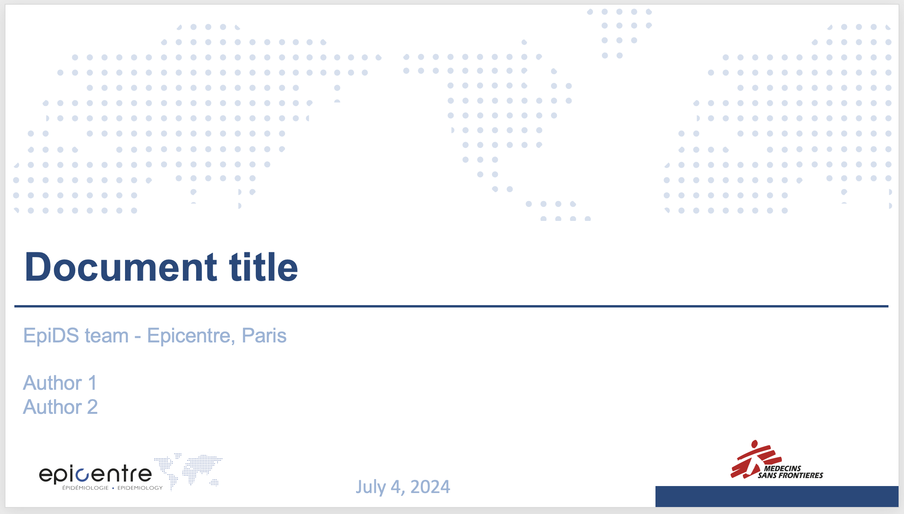
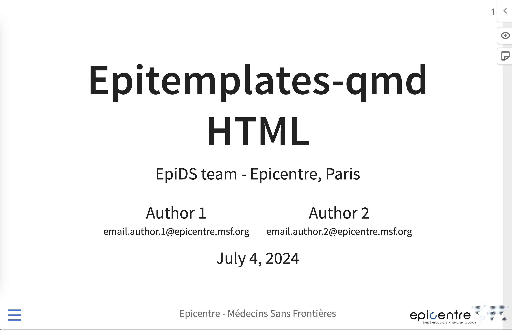

# epitemplates-report

EpiDS templates for quarto documents and presentations in multiple formats.

## Installation and usage

This project is distributed as a **Quarto template**, not a standalone extension.

It includes a complete project scaffold (e.g. `img/`, template file, etc.),
which **cannot be installed via `quarto add`**.

To create a new report using this template:

```bash
quarto use template epicentre-msf/epitemplates-report
```

And add the format to your YAML configuration, along with other HTML format options if needed:

```yaml
format:
    epitemplates-report-html:
        toc: true
        toc-depth: 3
        logo1: img/epicentre_msf_logo_transparent.png # top left of header
        logo2: img/another_logo.png # top right of header
```

Alternatively, you can also use the [epitemplates](https://github.com/epicentre-msf/epitemplates) R package from within R/Rstudio.
The template provides different formats, presented below.

## Available formats

The extension exposes five Quarto formats. Use any of these names under the
`format:` key in your document's YAML front matter:

- `epitemplates-report-html` — HTML report (recommended working format)
- `epitemplates-report-pdf` — PDF via LaTeX (KOMA-Script)
- `epitemplates-report-docx` — Microsoft Word document
- `epitemplates-report-pptx` — PowerPoint presentation
- `epitemplates-report-revealjs` — Browser-based reveal.js presentation

## Requirements

- **Quarto** ≥ 1.4.0
- **LaTeX** with a KOMA-Script document class (for the `pdf` format —
  Quarto's default `scrartcl` satisfies this; setting
  `documentclass: article` will not work because the bundled header loads
  `scrlayer-scrpage`)
- **R packages** used by the demo `template.qmd`:
  - `bslib`, `bsicons`, `scales` — required for the value-box showcase
  - `tidyverse`, `rio`, `janitor`, `fs`, `here`, `lubridate` — optional,
    only needed if you adapt the demo data-processing chunks

## Logo overrides

Every format exposes a way to swap the bundled Epicentre / EpiDS
logos for your own. Paths are always resolved **relative to the
consumer project root**, by convention an `img/` folder:

```
your-project/
├── _quarto.yml          # or your .qmd directly
├── report.qmd
└── img/
    ├── epicentre_msf_logo_transparent.png   # bundled default
    └── partner_logo.png                     # your override
```

### HTML — `logo1` / `logo2`

The HTML format accepts two header logos via YAML:

- `logo1` — top-left of the header
- `logo2` — top-right of the header

```yaml
format:
  epitemplates-report-html:
    logo1: img/epicentre_msf_logo_transparent.png
    logo2: img/partner_logo.png
```

The bundled default for `logo1` is
`img/epicentre_msf_logo_transparent.png`; `logo2` is unset by default.

### RevealJS — `logo`

RevealJS uses Quarto's built-in `logo:` field. The template ships
`img/epicentre_msf_logo_transparent.png` as the default; override
in your YAML:

```yaml
format:
  epitemplates-report-revealjs:
    logo: img/partner_logo.png
```

### PDF — `\pdflogo` / `\pdflogowidth`

The PDF format reads two LaTeX macros for the page-header logo:
`\pdflogo` (path) and `\pdflogowidth` (width, default `5cm`). The
extension provides defaults via `\providecommand`, so consumers
override by `\def`-ing the macros in `header-includes` (which is
processed before the extension's header):

```yaml
format:
  epitemplates-report-pdf:
    header-includes:
      - \def\pdflogo{img/partner_logo.png}
      - \def\pdflogowidth{4cm}
```

## Formats

<div align="center">

**`epitemplates-report-html`: html document**



**`epitemplates-report-pdf`: pdf document**



**`epitemplates-report-docx`: word document**



**`epitemplates-report-pptx`: powerpoint presentation**



**`epitemplates-report-revealjs`: revealjs presentation**


</div>
